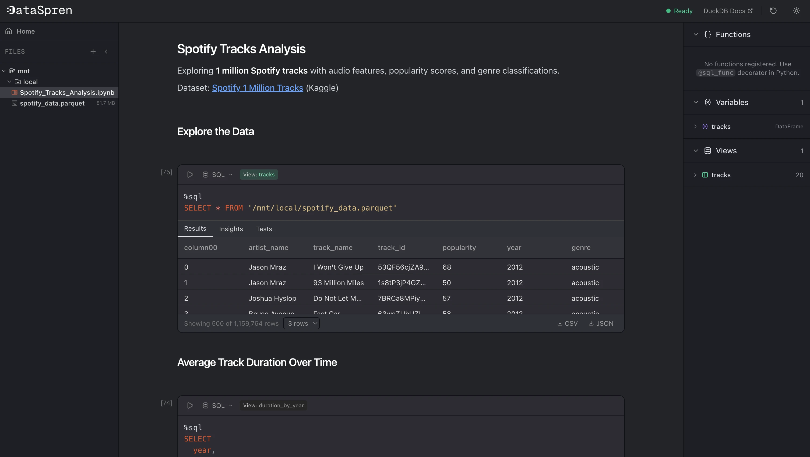

<div align="center">

# DataSpren Helix

**Explore and visualize data, entirely in your browser. Powered by WebAssembly and DuckDB. Your data stays on your machine.**

[](LICENSE)
[](https://pyodide.org)
[](https://duckdb.org)

[Live Demo](https://local.dataspren.com) | [Getting Started](#getting-started) | [Features](#features)



</div>

## Roadmap

- [ ] **External Storage** - Mount S3 buckets
- [ ] **AI UDFs** - AI SQL UDFs embed(col), cosine_sim(u, v), llm(model, prompt, col)
- [ ] **Ad hoc SQL** - .sql file support with executor + viewer

Have a feature request? [Open an issue](https://github.com/dataspren-analytics/datastudio/issues) and let us know!

---

## Why Helix?

Most data tools require a backend, cloud account, or sending your data somewhere. Helix runs **entirely in your browser**. Python and DuckDB execute via WebAssembly, and files are stored locally using the browser's Origin Private File System. There is no server, no upload, and nothing to install.

This makes it ideal for:

- **Quick data exploration**: drag in a CSV or Parquet file and start querying in seconds
- **Sensitive data**: financial, medical, or proprietary datasets that can't leave your machine
- **Offline work**: everything works without an internet connection after the initial load
- **Sharing analyses**: notebooks use the standard Jupyter `.ipynb` format

## Table of Contents

- [Features](#features)
- [Demo](#demo)
- [Getting Started](#getting-started)
- [Tech Stack](#tech-stack)
- [Contributing](#contributing)
- [License](#license)

## Features

| Feature | Description |
|---|---|
| **Notebook interface** | Multi-cell notebooks with Python, SQL, and Markdown cells. SQL cells automatically materialize as views accessible from Python. |
| **In-browser execution** | Python (Pyodide) and DuckDB run entirely in WebAssembly. Nothing leaves your machine. |
| **Data visualization** | Built-in charting (bar, line, area, scatter, pie) powered by ECharts. |
| **File management** | Upload, browse, and query CSV, Parquet, JSON, and Excel files. |
| **Data validation** | Built-in checks for uniqueness, not-null, accepted values, and custom SQL validations. |
| **Excel editing with SQL** | Query and transform Excel files directly using SQL. |

## Demo

### Notebook: Python, SQL, and Charts


### Excel Editing


## Getting Started

### Prerequisites

- Node.js 22+
- pnpm

### Run locally

```bash
pnpm install
pnpm dev
```

Open [http://localhost:3000](http://localhost:3000).

### Run with Docker

```bash
cp .env.example .env
docker compose up --build
```

## Tech Stack

| Technology | Role |
|---|---|
| [Next.js](https://nextjs.org) + React 19 | UI framework |
| [Pyodide](https://pyodide.org) | Python compiled to WebAssembly |
| [DuckDB](https://duckdb.org) | In-process analytical SQL engine |
| [ECharts](https://echarts.apache.org) | Data visualization |
| [CodeMirror](https://codemirror.net) | Code editor |
| [Tailwind CSS](https://tailwindcss.com) + [Radix UI](https://www.radix-ui.com) | Styling and components |

## Contributing

Contributions are welcome! Feel free to open an issue or submit a pull request.

## License

[MIT](LICENSE). Copyright (c) 2026 Dataspren
