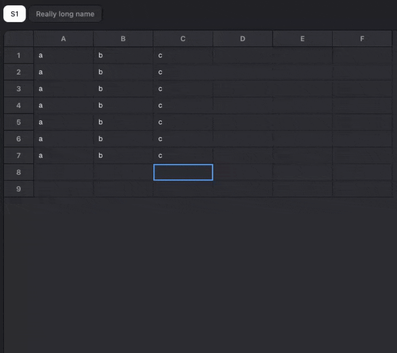

# DataSpren Data Studio

Developed by [DataSpren](https://dataspren.com)

A browser-based data notebook for exploring, transforming, and visualizing data. No backend required.

**Try it at [local.dataspren.com](https://local.dataspren.com).**

## Demo


### Excel Editing



Python and SQL run directly in your browser via WebAssembly (Pyodide + DuckDB). Files are stored locally using the Origin Private File System.

## Features

- **Notebook interface**: Create multi-cell notebooks with Python, SQL, Markdown, and Assert cells
- **In-browser execution**: Python and DuckDB run entirely in WebAssembly, nothing leaves your machine
- **Data visualization**: Built-in charting (bar, line, area, scatter, pie) powered by ECharts
- **File management**: Upload, browse, and query CSV, Parquet, JSON, and Excel files
- **Data validation**: Assert cells for uniqueness, not-null, accepted values, and custom SQL checks
- **Excel editing with SQL**: Query and transform Excel files directly using SQL

## Getting Started

### Prerequisites

- Node.js 22+
- pnpm

### Run locally

```bash
pnpm install
pnpm dev
```

Open [http://localhost:3000](http://localhost:3000).

### Run with Docker

```bash
cp .env.example .env
docker compose up --build
```

## Architecture

Everything runs in the browser. There is no application server.

### Execution

Pyodide (Python compiled to WebAssembly) runs inside a dedicated **Web Worker** so the UI thread is never blocked. DuckDB runs inside the same Pyodide environment. The main thread communicates with the worker via a request/response message protocol for code execution, SQL queries, file operations, and introspection (listing tables, variables, functions).

### Virtual File System

The app uses a layered file system abstraction to give Pyodide and DuckDB direct access to files:

```
VirtualFS (multiplexer + Emscripten integration)
├── /mnt/local    → OPFS Device (browser-native persistent storage)
└── /mnt/bucket   → S3 Device (remote object storage, optional)
```

**Storage devices** implement a common `IStorageDevice` interface (read, write, delete, list, sync handles) and know nothing about Emscripten. The **VirtualFS** layer mounts them at different paths and handles all Emscripten integration so DuckDB and Python can access files using normal file paths.

**OPFS Device**: Uses the browser's Origin Private File System with synchronous access handles for zero-copy byte-range reads. This means DuckDB can read Parquet files efficiently (scanning only the columns and row groups it needs) instead of loading entire files into memory. Data persists across page refreshes without any server.

**S3 Device** (not yet stable): Lists remote objects lazily (metadata only) and downloads files on demand. Uses a SharedArrayBuffer + Atomics bridge to provide synchronous byte-range reads to DuckDB without blocking, with 256KB read-ahead caching for efficient Parquet scanning. Currently disabled while we stabilize the implementation.

### State Management

React context providers compose in layers:

```
DataStudioProvider
  └── RuntimeProvider        (execution backend, file I/O, status)
       └── NotebookProvider  (notebook CRUD, persistence, active notebook)
            └── CellProvider (cell execution, outputs, selection)
```

Notebooks follow the Jupyter `.ipynb` format (nbformat v4.5) extended with DataSpren metadata for SQL view names, assert configurations, and cell types (Python, SQL, Markdown, Assert).

## Tech Stack

- [Next.js](https://nextjs.org) + React 19
- [Pyodide](https://pyodide.org): Python in WebAssembly
- [DuckDB](https://duckdb.org): In-process SQL engine
- [ECharts](https://echarts.apache.org): Data visualization
- [CodeMirror](https://codemirror.net): Code editing
- [Tailwind CSS](https://tailwindcss.com) + [Radix UI](https://www.radix-ui.com)

## License

[MIT](LICENSE)
